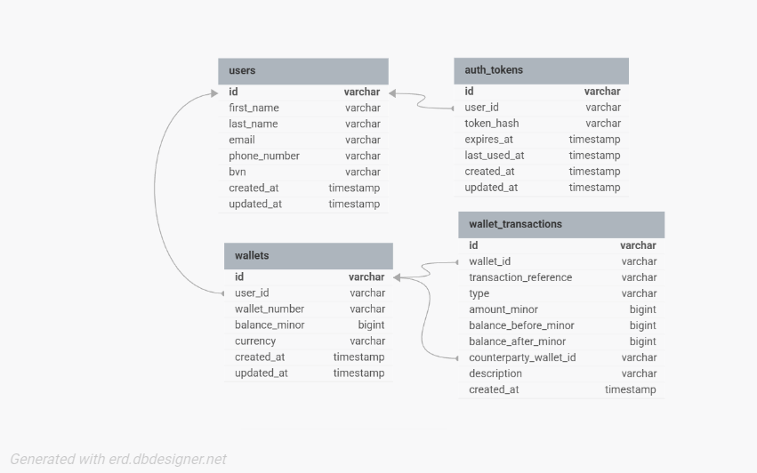

# Demo Wallet Service

Demo Credit wallet MVP built with Node.js, TypeScript, Express, Knex, and MySQL for the Lendsqr Backend Engineer Assessment.

## Overview

This service supports:

- user registration
- faux token login
- blacklist screening through Lendsqr Adjutor Karma
- wallet creation on successful onboarding
- wallet funding
- wallet transfers
- wallet withdrawals
- transaction history retrieval

## Tech Stack

- Node.js
- TypeScript
- Express
- Knex
- MySQL
- Jest

## Architecture

The codebase uses a layered structure:

- `controllers/` handles HTTP request and response mapping
- `services/` contains business logic and transaction scoping
- `repositories/` contains Knex database queries
- `middleware/` handles authentication and error responses
- `models/` defines domain shapes
- `types/` contains request and shared types
- `utils/` contains helpers like validation, money conversion, errors, and ids
- `database/migrations/` defines schema changes

### Why this design

- Controllers stay thin and easy to read.
- Services own the rules of the system.
- Repositories isolate SQL concerns from business logic.
- Wallet balance changes are performed inside database transactions.

## Database Design

### Tables

- `users`
- `wallets`
- `auth_tokens`
- `wallet_transactions`

### Key decisions

- `email`, `phone_number`, `bvn`, and `wallet_number` are unique.
- `wallets.user_id` is unique to enforce one wallet per user.
- `token_hash` is stored instead of raw tokens.
- money is stored in minor units such as kobo to avoid floating point errors.
- transfer operations create two ledger rows with the same `transaction_reference`.

## E-R Diagram




## API Endpoints

### Auth

- `POST /api/v1/auth/register`
- `POST /api/v1/auth/login`

### Wallet

- `GET /api/v1/wallets/me`
- `GET /api/v1/wallets/transactions`
- `POST /api/v1/wallets/fund`
- `POST /api/v1/wallets/transfer`
- `POST /api/v1/wallets/withdraw`

### Health

- `GET /health`

## Example Requests

### Register

```json
{
  "firstName": "Ada",
  "lastName": "Lovelace",
  "email": "ada@example.com",
  "phoneNumber": "08000000000",
  "bvn": "12345678901"
}
```

### Login

```json
{
  "email": "ada@example.com",
  "bvn": "12345678901"
}
```

### Fund Wallet

```json
{
  "amount": 5000,
  "description": "Initial funding"
}
```

### Transfer Funds

```json
{
  "recipientWalletNumber": "1234567890",
  "amount": 1500,
  "description": "Repayment"
}
```

### Withdraw Funds

```json
{
  "amount": 1000,
  "description": "Cash out"
}
```

## Authentication

This assessment does not require full authentication, so the project uses a lightweight bearer-token flow:

- user registers or logs in
- the API returns a token
- the token hash is stored in `auth_tokens`
- protected routes require `Authorization: Bearer <token>`

## Transaction Scoping

Wallet mutation flows use database transactions:

- funding updates wallet balance and writes a ledger row in one transaction
- withdrawal validates balance, updates the wallet, and writes a ledger row in one transaction
- transfer locks sender and recipient wallets, updates both balances, and writes both ledger rows in one transaction

This prevents half-completed balance changes.

## Blacklist Handling

During registration, the service checks the user against Lendsqr Adjutor Karma using:

- BVN
- email
- phone number

If a user is blacklisted, onboarding is rejected.
If blacklist verification is unavailable, onboarding fails closed.

## Local Setup

1. Install dependencies:

```bash
npm install
```

2. Create a root `.env` file using `.env.example`

3. Run migrations:

```bash
npm run migrate:latest
```

4. Start the server:

```bash
npm run dev
```

## Environment Variables

Required values:

- `DB_HOST`
- `DB_PORT`
- `DB_NAME`
- `DB_USER`
- `DB_PASSWORD`
- `ADJUTOR_API_KEY`

Optional values:

- `PORT`
- `NODE_ENV`
- `ADJUTOR_BASE_URL`
- `ADJUTOR_TIMEOUT_MS`

## Testing

The project includes unit tests for:

- auth success and failure
- user registration success
- duplicate registration rejection
- blacklist rejection
- wallet funding
- insufficient withdrawal balance
- transfer validation rules

Run tests with:

```bash
npm test
```

## Future Improvements

- replace faux auth with a full credential flow
- add request schema validation with a dedicated validation library
- add pagination for transaction history
- add idempotency keys for sensitive money movement operations
- add integration tests for HTTP routes
- add CI for lint, tests, and migration checks
